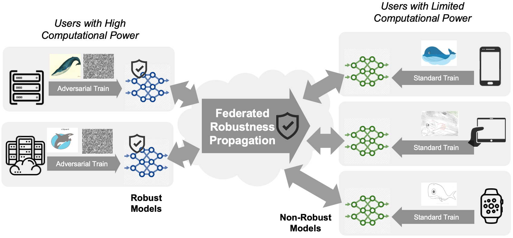

FedRBN for Federated Robustness Propagation
===========================================

PyTorch implementation for paper: "Federated Robustness Propagation: Sharing Robustness in Heterogeneous Federated Learning", [Junyuan Hong](https://jyhong.gitlab.io/), [Haotao Wang](https://htwang14.github.io/), [Zhangyang Wang](https://vita-group.github.io/) and [Jiayu Zhou](https://jiayuzhou.github.io/). *AAAI'23*

[paper](https://arxiv.org/abs/2106.10196) / [code](https://github.com/illidanlab/FedRBN) / [slides]() / [poster]().

**TL;DR** As AT is computation-intensive and users in FL have heterogeneous computation resources, *Federated Robustness Propagation (FRP)* aims to share the AT users' robustness with ST users.
We propose the first simple yet effective algorithm to conduct FRP.



**Abstract**

Federated learning (FL) emerges as a popular distributed learning schema that learns a model from a set of participating users without sharing raw data. One major challenge of FL comes with heterogeneous users, who may have distributionally different (or non-iid) data and varying computation resources. As federated users would use the model for prediction, they often demand the trained model to be robust against malicious attackers at test time. Whereas adversarial training (AT) provides a sound solution for centralized learning, extending its usage for federated users has imposed significant challenges, as many users may have very limited training data and tight computational budgets, to afford the data-hungry and costly AT. In this paper, we study a novel FL strategy: propagating adversarial robustness from rich-resource users that can afford AT, to those with poor resources that cannot afford it, during federated learning. We show that existing FL techniques cannot be effectively integrated with the strategy to propagate robustness among non-iid users and propose an efficient propagation approach by the proper use of batch-normalization. We demonstrate the rationality and effectiveness of our method through extensive experiments. Especially, the proposed method is shown to grant federated models remarkable robustness even when only a small portion of users afford AT during learning.


## Usage

**Preparation**:
1. *Package dependencies*: Use `conda env create -f environment.yml` to create a conda env and
activate by `conda activate fedrbn`. Major dependencies include
`pytorch, torchvision, wandb, numpy, thop` for model size customization, and `advertorch`
for adversarial training.
2. *Data*: Set up your paths to data in [utils/config.py](utils/config.py). Refer to 
[FedBN](https://github.com/med-air/FedBN#dataset--pretrained-modeel) for details of Digits and 
DomainNet datasets.
   * Digits: Download the [FedBN Digits zip file](https://drive.google.com/file/d/1moBE_ASD5vIOaU8ZHm_Nsj0KAfX5T0Sf/view?usp=sharing) to `DATA_PATHS['Digits']'` 
   defined in `utils.config`.  Unzip all files.
   * DomainNet: Download the [FedBN DomainNet split file](https://drive.google.com/file/d/1_dx2-YDdvnNlQ13DTgDnLoGvMZvMyccR/view?usp=sharing) to `DATA_PATHS['DomainNetPathList']` 
   defined in `utils.config`. Download [Clipart](http://csr.bu.edu/ftp/visda/2019/multi-source/groundtruth/clipart.zip),
   [Infograph](http://csr.bu.edu/ftp/visda/2019/multi-source/infograph.zip),
   [Painting](http://csr.bu.edu/ftp/visda/2019/multi-source/groundtruth/painting.zip), 
   [Quickdraw](http://csr.bu.edu/ftp/visda/2019/multi-source/quickdraw.zip), 
   [Real](http://csr.bu.edu/ftp/visda/2019/multi-source/real.zip), 
   [Sketch](http://csr.bu.edu/ftp/visda/2019/multi-source/sketch.zip), put under 
   `DATA_PATH['DomainNet']` directory. Unzip all files.

**Train and test**: Set `--data` to be one of `Digits`, `DomainNet`, `Cifar10`. Set `--mode` to desired algorithms.
 ```shell
 # FedRBN
 python fedat.py --mode fedrbn --data Digits # train
 python fedat.py --mode fedrbn --data Digits --test --test_noise LinfPGD # test with LinfPGD attack
 ```
Use sweeps with tuned hyper-parameters. Modify `sweeps/bmk_noise_ratio/digits.yaml` for different settings, e.g., number of AT domains (`n_noise_domain`) or ratio of AT users per domain (`noise_ratio`).
```shell
# Digits
wandb sweep sweeps/benchmark/digits.yaml  # train
wandb sweep sweeps/benchmark/digits_test.yaml  # test
# DomainNet
wandb sweep sweeps/benchmark/digits.yaml  # train
wandb sweep sweeps/benchmark/digits_test.yaml  # test
```

## Acknowledgement

The codes are greatly based on [FedBN repo](https://github.com/med-air/FedBN.git).

## Citation

```bibtex
@article{hong2021fedrbn,
  title={Federated robustness propagation: Sharing adversarial robustness in federated learning},
  author={Hong, Junyuan and Wang, Haotao and Wang, Zhangyang and Zhou, Jiayu},
  journal={arXiv preprint arXiv:2106.10196},
  year={2021}
}
```
